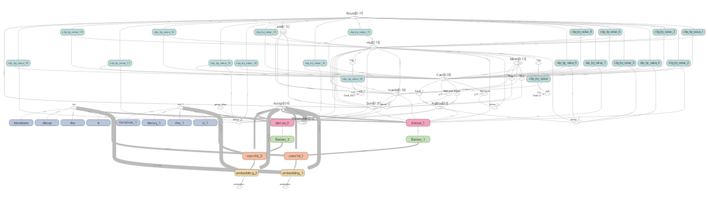
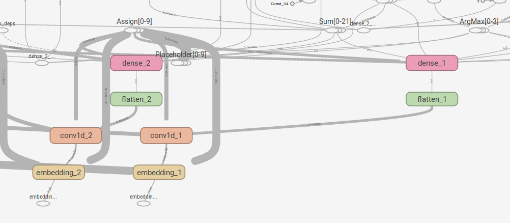

# Keras Convolutional Text Punctuator

Is a small experimental project to punctuate text using a embedding layer, single convolutional layer and output softmax layer written in Keras. In current state it attempt to locate any of ",;.!?" and place a dot in their location.

This project is being used in practice in my Android app Youtube Reader: [https://github.com/vackosar/youtube-reader](https://github.com/vackosar/youtube-reader).

## Usage

Python script can be used as a standalone punctuation tool in following way:
 
``` ./punctuator.py file```

The program will produce several output files into your working directory. The final output file is named ```<file>.txt.punct.punct.proc.txt```.

Execution requires Tensorflow, Keras and Numpy installed.

## Inspirational Project

Punctuator 2 by Ottokar Tilk at: https://github.com/ottokart/punctuator2

> A bidirectional recurrent neural network model with attention mechanism for restoring missing inter-word punctuation in unsegmented text.
  
Project used framework not suitable for Android and harder to read. Furthermore used RNN instead of simpler CNN. 

## Data Preparation

First used EU Parliament transcription data, but that was expectantly suboptimal choice. Style of the speech was too far from average. The usual words were used and the sentence length seemed longer. I subjectively improved using News Commentary data.

After cleaning the data, word index is built from 20k most occurring words. Word index maps words to either their frequency number or to a default token in case they are not in 20k most common ones.

Number of samples used was within order of magnitude of millions.


## Model Overview

```python
    model.add(createEmbeddingLayer(wordIndex))
    model.add(Conv1D(512, 3, activation='relu'))
    if wordIndex is not None:
        model.add(Dropout(0.25))
    model.add(Flatten())
    model.add(Dense(LABELS_COUNT, activation='softmax'))
```

Input layer is provided with 30 word token integer numbers for which we predict if there was one character from ",;.!?". Tokens are aquired by mapping words using the word index described above. 

Embedding layer used is a projection of GloVe Embedding:
> GloVe is an unsupervised learning algorithm for obtaining vector representations for words. Training is performed on aggregated global word-word co-occurrence statistics from a corpus, and the resulting representations showcase interesting linear substructures of the word vector space. 

Convolutional layer is single dimensional:
> shift invariant or space invariant artificial neural network (SIANN), based on its shared-weights architecture and translation invariance characteristics.[

Regularization preventing over-learning is performed by the Dropout Algorithm.

Last layer is simple two neuron fully or densely connected layer.
   
Prediction output consisting of two float values is computed as softmax of activations of the two output neurons.


### Full View


### Zoomed


## Performance

- Precision: 92%
- Recall: 92%
- F Score: 92%

I am  not confident in Recall and F Score measures, but Precision one is accurate.

### Examples

Original Piece Of Test Data:
> their lives in Spanish and United States history classes. Vice President Joseph R. Biden Jr. discusses a myriad of foreign and domestic issues and Justice Elena Kagan breaks her silence. The book on Manning says teams must pressure him to beat him. Times Reader 2.0 Try it FREE for 2 full weeks. New discoveries in the Mush Valley in Ethiopia include 22 million year old fossils of mammals as well as evidence of leaf consumption by insects. And, Please, No Shirtless Shots. A Room for Debate forum on why the shootings in Arizona have not led to calls for more gun control. Letters Mementos or Mess?

Punctuated Piece Of Test Data:
> Their lives in spanish and united states history classes. Vice president joseph r. Biden jr. Jr. Discusses a myriad of foreign and domestic issues and justice elena kagan breaks her silence. The book on manning. Says teams must pressure him to beat him. Times reader 20. Try it free for 2 full weeks. New discoveries in the mush valley in ethiopia include 22 million year old fossils of mammals as well as evidence of leaf consumption by insects and please no shirtless shots. A room for debate forum on why the shootings in arizona have not led to calls for more gun control. Letters mementos or mess 

Original Elon Musk Interview Sample:
> Well, this was when I was six, so the memory is a little fuzzy at this point. But as I recall, I was grounded for some reason. I don’t know why but I felt it was unjust and I really wanted to go to this party, my cousin’s party, who was five…a kids’ party. So at first, I was going to take my bike and I told my mom this, which was a mistake and she told me some story about how you needed a license for a bike and the police would stop me. So I wasn’t 100% sure if that was true or not, but I thought I’d better walk just in case. I sort of thought I knew the way, but it was clear across town 10 or 12 miles really quite far, further than I realized actually…So I just started walking to my cousin’s house. It took me about four hours and just as my mom was leaving the party with my brother and sister, she saw me walking down the road and freaked out. I saw she saw me, so I then sprinted to my cousin’s house – I was just about two blocks away – and climbed a tree and refused to come down.

Punctuated Elon Musk Interview Youtube captions:
> Well this was when i was six. So the memory is a little fuzzy fuzzy at this point. But as i recall i was grounded for some reason. In't know why but i felt it was unjust and i really wanted to go to this party. My cousin's party who was five a kids' party so at first i was going to take my bike and i told my mom this which was a mistake and she told me some story about how you needed a license for a bike and the police would stop me so i wasn't 100 sure if that was true or not. But i thought i'd better walk just in case. I sort of thought i knew the way. But it was clear across town 10 or 12 miles really quite far further than i realized actually so i just started walking to my cousin's house. It took me about four hours and just as my mom was leaving the party with my brother and sister. She saw me walking down the road and freaked out. I saw she saw me so i then sprinted to my cousin's house. I was just about two blocks away and climbed a tree and refused to come down